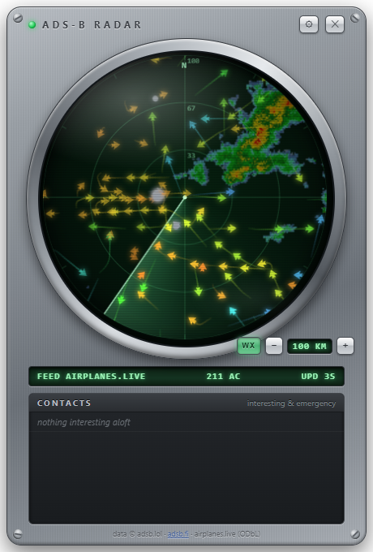

# ADS-B Radar Gadget

A skeuomorphic desktop radar disc (Vista-gadget vibe) showing live aircraft
around home. Answers "what's the loud thing overhead" and fires **silent**
Windows toasts for interesting/emergency traffic. Pinned to the desktop layer —
occluded by foreground windows, visible on Win+D. Never steals focus.

Tauri (Rust core + webview). All HTTP happens in Rust: polling, feed
failover, route caching, and edge-triggered alert state live in one place.



## Build & run

Prereqs: Rust (MSVC toolchain) + VS Build Tools C++ workload + WebView2
(stock on Win11).

```
cd src-tauri
cargo build            # dev build
cargo run              # launch the gadget
cargo build --release  # optimized; binary at target/release/adsb-radar.exe
```

No Node/npm — the UI (`ui/`) is plain HTML/CSS/Canvas served by Tauri.

## Data feeds

All feeds share the ADSBExchange v2 response schema; base URLs are config.
Verified endpoint shapes (July 2026):

| feed | point query | squawk query |
|---|---|---|
| adsb.lol (primary) | `/v2/lat/{lat}/lon/{lon}/dist/{nm}` | `/v2/sqk/{sqk}` |
| adsb.fi | `/api/v2/lat/{lat}/lon/{lon}/dist/{nm}` | `/api/v2/sqk/{sqk}` |
| airplanes.live | `/v2/point/{lat}/{lon}/{nm}` | `/v2/squawk/{sqk}` |

Note: the adsb.lol point API is **v2** — the v3 path form 404s.
Failover: last-good feed is tried first, then the rest in config order, on any
HTTP error or rate-limit. adsbexchange.com itself is paid and not used.
Routes come from **adsbdb** (`/v0/callsign/{cs}`), cached per callsign, with
negative caching for confirmed unknowns only. adsbdb maps callsign → filed
route with no reality check and airlines reuse callsigns, so every route is
**plausibility-checked** against the aircraft's actual position and track
(corridor test: origin→aircraft→destination detour ≤ 300 km; heading test:
track within 100° of the bearing to destination when > 150 km from both
endpoints). Implausible routes show struck-through + ⚠ in the tooltip, with
an explanation in the card, and are suppressed in the contacts list.
(adsb.lol's `/api/0/routeset` — which does this server-side — currently
returns 201 with an empty body, so the check is local.)
On-ground aircraft get a nearest-airport tag ("on ground @ ORD") in toasts,
tooltip, card, and the contacts list — resolved against an embedded
OurAirports dataset (public domain; large+medium airports, 10 km cutoff),
`src-tauri/airports.dat`.

**Attribution:** aircraft data © [adsb.lol](https://adsb.lol) (ODbL 1.0),
[adsb.fi](https://adsb.fi) (non-commercial, 1 req/s), [airplanes.live](https://airplanes.live).
The gadget shows this in its footer.

## Polling

- **Poll A** — point/radius query around home every ~5 s: feeds the disc and
  the overhead / regional-interesting / local-emergency classification.
- **Poll B** — global `sqk` 7500/7600/7700, staggered inside a ~60 s sweep.
- Both budgets stay under adsb.fi's hard 1 req/s even during failover.

## Classification → alerts

- `dbFlags`: bit 0 military, bit 1 interesting, bit 2 PIA, bit 3 LADD.
- `emergency`: DO-260B priority status (superset of the 7×00 squawks) — read
  directly; squawk-list matching is the backup.
- **Overhead** = within overhead radius, below the altitude ceiling, not on ground.
- **Regional-interesting** = mil / db-interesting / `B2` balloon / watchlist.
  Watchlist entries match ICAO type codes exactly; suffix `*` for a callsign
  prefix (`RCH*`). Bare prefix matching is deliberately off — a `C17` entry
  once flagged "C174", which turned out to be an O'Hare follow-me truck.
- Emitter category `C1`–`C5` (surface vehicles, fixed obstructions) is
  excluded from every alert class — they broadcast ADS-B but aren't aircraft.
  They still draw on the disc, labeled as vehicles.
- **Emergency** = non-`none` emergency field or listed squawk, local or global.

Alerts are **edge-triggered per hex**: fire once on entering a class, re-arm
only after leaving it *and* the cooldown elapsing. Toasts are silent
(`<audio silent="true"/>`). Clicking a toast raises the gadget and opens that
aircraft's card.

## The disc

- **PPI paint**: a blip's drawn position refreshes only when the sweep
  crosses its bearing — dots update under the beam, not in unison. Fresh
  poll data waits invisibly until the beam comes around; contacts that stop
  reporting ghost out over ~16 s of phosphor decay.
- **Weather underlay (WX button)**: NEXRAD composite from the Iowa
  Environmental Mesonet (free, no key), fetched in Rust as 5-minute-cached
  tiles and returned to the webview as data URLs (no page HTTP, no canvas
  taint), drawn dim beneath the grid so the phosphor look survives. The
  toggle persists in config (`wx_enabled`).

## Window behavior

`desktop_mode` in config:

- `auto` (default): find `Progman`, send `0x052C` (both known variants) to
  spawn the `WorkerW` behind the desktop icons, `SetParent` onto it — the
  Rainmeter / Wallpaper Engine technique. Only accepted when the *classic*
  layout signature is present (`SHELLDLL_DefView` hosted by a WorkerW);
  otherwise falls back to:
- `bottom`: a `WS_EX_NOACTIVATE` tool window **owned by `Progman`** — Windows
  keeps an owned window directly above its owner in the z-order, which is
  exactly the desktop-gadget slot: under every app window, above the
  desktop, and it still receives mouse input. A 2 s `HWND_BOTTOM` re-assert
  floors it there (with the owner set, `HWND_BOTTOM` can't sink further).
- `workerw`: force the reparent; on Win11 24H2+ (where `SHELLDLL_DefView`
  never leaves `Progman` and no wallpaper WorkerW spawns) this additionally
  tries parenting onto `Progman` itself.
- `normal`: plain window, for debugging.

**Verified on this machine (Win11 Pro 26200, July 2026):** the classic
WorkerW technique does not land — 24H2 changed the desktop window tree — so
`auto` uses `bottom`. Two 24H2 traps, both verified with `WindowFromPoint`
hit-tests: (1) the `workerw` force-mode parents onto Progman but sits behind
the icon listview, which eats all mouse input — look-but-don't-touch; (2) a
plain `HWND_BOTTOM` (without the Progman-owner tie) sinks *beneath* the
desktop windows — still visible via DWM composition, but every click lands on
the icon listview instead (desktop marquee/context menu). The owner tie is
what makes `bottom` both correctly layered and interactive.
Settings inputs need keyboard focus, so the UI temporarily clears
`WS_EX_NOACTIVATE` while the settings panel is open (bottom mode only).

## Config

Live-editable from the gear panel (no rebuild); stored at
`%APPDATA%\adsb-radar\config.json`. Keys: `home_lat/lon`,
`overhead_radius_km`, `overhead_ceiling_ft`, `regional_radius_nm` (≤250),
`watchlist`, `poll_local_secs`, `poll_sqk_secs`, `alert_cooldown_secs`,
`default_zoom_km`, `zoom_steps_km`, `emergency_squawks`, `toast_sound`
(default off), `desktop_mode` (restart to apply), `feeds` (order = failover
order). Default home is downtown Chicago — set yours first.

## Known limitations (accepted)

- "Loud" is proxied by low + close; no acoustic detection.
- Non-broadcasting aircraft (many police/EMS/mil helos) are invisible to
  ADS-B — a data-source limit, not a bug.
- Toasts use the PowerShell AppUserModelID (the standard unpackaged-app
  workaround), so they're branded "Windows PowerShell". Packaging with a Start
  Menu shortcut + own AUMID would fix the branding; not wired up in v1.
- Window position isn't persisted across restarts yet.

## Prior art

`socquique/capsule-radar` — disc rendering, adsbdb route caching, and the
edge-triggered alert pattern are cribbed from its approach; this is a fresh
Tauri build, not a port.
