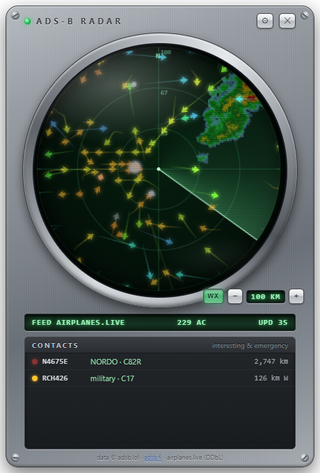

# ADS-B Radar Gadget

A skeuomorphic desktop radar disc (Vista-gadget vibe) that shows live aircraft around home. It answers "what is the loud thing overhead" and fires **silent** Windows toasts for interesting or emergency traffic. The gadget pins to the desktop layer: foreground windows occlude it, and Win+D reveals it. It never steals focus.

Tauri (Rust core plus webview). All HTTP happens in Rust: polling, feed failover, route caching, and edge-triggered alert state live in one place.



## Download (no tools needed)

Get the latest installer from [**Releases**](https://github.com/coldcraft/desktopradar/releases):

- **Windows**: run the `*-setup.exe`. SmartScreen warns because the app has no code signature. Click **More info → Run anyway**. WebView2 installs automatically if missing.
- **macOS**: open the `.dmg` and drag ADS-B Radar to Applications. Gatekeeper blocks the first launch (unsigned app). Use **System Settings → Privacy & Security → Open Anyway**.

First run: click the gear (⚙) and set your home latitude/longitude. The disc centers on it, and "overhead" alerts key off it.

## Build & run

Prereqs: Rust (MSVC toolchain) + VS Build Tools C++ workload + WebView2 (stock on Win11).

```
cd src-tauri
cargo build            # dev build
cargo run              # launch the gadget
cargo build --release  # optimized; binary at target/release/adsb-radar.exe
```

No Node/npm. The UI (`ui/`) is plain HTML/CSS/Canvas that Tauri serves.

## Data feeds

All feeds share the ADSBExchange v2 response schema. Base URLs are config. Verified endpoint shapes (July 2026):

| feed | point query | squawk query |
|---|---|---|
| adsb.lol (primary) | `/v2/lat/{lat}/lon/{lon}/dist/{nm}` | `/v2/sqk/{sqk}` |
| adsb.fi | `/api/v2/lat/{lat}/lon/{lon}/dist/{nm}` | `/api/v2/sqk/{sqk}` |
| airplanes.live | `/v2/point/{lat}/{lon}/{nm}` | `/v2/squawk/{sqk}` |

Note: the adsb.lol point API is **v2**. The v3 path form 404s.

Failover tries the last-good feed first, then the rest in config order, on any HTTP error or rate-limit. The adsbexchange.com API itself is paid, so the gadget does not use it.

Routes come from **adsbdb** (`/v0/callsign/{cs}`), cached per callsign, with negative caching for confirmed unknowns only. The adsbdb service maps a callsign to its filed route with no reality check, and airlines reuse callsigns. The gadget therefore **plausibility-checks** every route against the actual aircraft position and track. Corridor test: the origin→aircraft→destination detour must stay ≤ 300 km. Heading test: the track must stay within 100° of the bearing to the destination. This test applies when the aircraft is > 150 km from both endpoints. Implausible routes show struck-through with ⚠ in the tooltip, and the card explains why. The contacts list suppresses them. The adsb.lol `/api/0/routeset` endpoint does this server-side, but it currently returns 201 with an empty body. The check is local for that reason.

On-ground aircraft get a nearest-airport tag ("on ground @ ORD") in toasts, the tooltip, the card, and the contacts list. The lookup uses an embedded OurAirports dataset at `src-tauri/airports.dat` (public domain, large and medium airports, 10 km cutoff).

**Attribution:**

- aircraft data © [adsb.lol](https://adsb.lol) (ODbL 1.0)
- [adsb.fi](https://adsb.fi) (non-commercial, 1 req/s)
- [airplanes.live](https://airplanes.live)

The gadget shows this attribution in its footer.

## Polling

- **Poll A**: a point/radius query around home every ~5 s. It feeds the disc and the overhead / regional-interesting / local-emergency classification.
- **Poll B**: a global `sqk` 7500/7600/7700 query, staggered inside a ~60 s sweep.
- Both budgets stay under the hard adsb.fi 1 req/s limit, even during failover.

## Classification and alerts

- `dbFlags`: bit 0 military, bit 1 interesting, bit 2 PIA, bit 3 LADD.
- `emergency`: DO-260B priority status (a superset of the 7×00 squawks). The gadget reads it directly. Squawk-list matching is the backup.
- **Overhead** = within the overhead radius, below the altitude ceiling, not on ground.
- **Regional-interesting** = mil / db-interesting / `B2` balloon / watchlist. Watchlist entries match ICAO type codes exactly. Suffix `*` gives a callsign prefix (`RCH*`). Bare prefix matching is deliberately off. A `C17` entry once flagged "C174", which turned out to be an O'Hare follow-me truck.
- Every alert class excludes emitter category `C1`-`C5` (surface vehicles, fixed obstructions). They broadcast ADS-B but are not aircraft. They still draw on the disc, labeled as vehicles.
- **Emergency** = a non-`none` emergency field or a listed squawk, local or global.

Alerts **edge-trigger per hex**: fire once on entry into a class. Re-arm happens only after the aircraft leaves the class *and* the cooldown elapses. Toasts are silent (`<audio silent="true"/>`). A click on a toast raises the gadget and opens the card for that aircraft.

## The disc

- **PPI paint**: a blip redraws only when the sweep crosses its bearing. Dots update under the beam, not in unison. Fresh poll data waits invisibly until the beam comes around. Contacts that stop reporting ghost out over ~16 s of phosphor decay.
- **Weather underlay (WX button)**: NEXRAD composite from the Iowa Environmental Mesonet (free, no key). Rust fetches it as 5-minute-cached tiles. The tiles return to the webview as data URLs (no page HTTP, no canvas taint). The disc draws it dim beneath the grid, so the phosphor look survives. The toggle persists in config (`wx_enabled`).
- **↗ TRACK** (aircraft card): opens the live track for the contact on `globe.adsbexchange.com` in the default browser. This is the "dig into a NORDO" escape hatch. The globe map is free to eyeball (only the API is paid). It works even after a contact fades from local scope, because the card keeps its hex.
- **ALT (altitude band filter)**: a dual slider (floor + ceiling) that hides blips outside the band. Declutter to just the high stuff, or just the low-and-close stuff. Ceiling at max reads "50k+" (and above). Ground traffic counts as 0 ft. The filter never hides unknown-altitude contacts. It is display-only and persists in config (`alt_filter_on`, `alt_floor_ft`, `alt_ceiling_ft`).
- **Range follows zoom**: the point poll widens to match the current zoom (feed cap 250 NM ≈ 463 km). Zooming out then reveals distant traffic instead of an empty ring past the configured regional radius. The UI reports its zoom to Rust (`set_view_radius`). Effective query radius = max(regional radius, current zoom). Expect a ~one-poll (≈5 s) lag after zooming out before far traffic populates.

## Window behavior

`desktop_mode` in config:

- `auto` (default): find `Progman`, send `0x052C` (both known variants) to spawn the `WorkerW` behind the desktop icons, then `SetParent` onto it. This is the Rainmeter / Wallpaper Engine technique. The gadget only accepts the result when the *classic* layout signature is present (`SHELLDLL_DefView` hosted by a WorkerW). Otherwise it falls back to:
- `bottom`: a `WS_EX_NOACTIVATE` tool window **owned by `Progman`**. Windows keeps an owned window directly above its owner in the z-order. That is exactly the desktop-gadget slot: under every app window, above the desktop, and it still receives mouse input. A 2 s `HWND_BOTTOM` re-assert floors it there. With the owner set, `HWND_BOTTOM` cannot sink further.
- `workerw`: force the reparent. On Win11 24H2+, `SHELLDLL_DefView` never leaves `Progman` and no wallpaper WorkerW spawns, so this mode also tries parenting onto `Progman` itself.
- `normal`: plain window, for debugging.

**Verified on this machine** (Win11 Pro 26200, July 2026): the classic WorkerW technique does not land. 24H2 changed the desktop window tree, so `auto` uses `bottom`. Two 24H2 traps, both verified with `WindowFromPoint` hit-tests:

1. The `workerw` force-mode parents onto Progman but sits behind the icon listview, which eats all mouse input. Look, but do not touch.
2. A plain `HWND_BOTTOM` (without the Progman-owner tie) sinks *beneath* the desktop windows. It stays visible via DWM composition, but every click lands on the icon listview instead (desktop marquee/context menu).

The owner tie is what makes `bottom` both correctly layered and interactive. Settings inputs need keyboard focus, so the UI temporarily clears `WS_EX_NOACTIVATE` while the settings panel is open (bottom mode only).

## Config

Live-editable from the gear panel (no rebuild). Stored at `%APPDATA%\adsb-radar\config.json`. Keys: `home_lat/lon`, `overhead_radius_km`, `overhead_ceiling_ft`, `regional_radius_nm` (≤250), `watchlist`, `poll_local_secs`, `poll_sqk_secs`, `alert_cooldown_secs`, `default_zoom_km`, `zoom_steps_km`, `emergency_squawks`, `toast_sound` (default off), `wx_enabled`, `alt_filter_on` / `alt_floor_ft` / `alt_ceiling_ft` (altitude band filter), `desktop_mode` (restart to apply), `feeds` (order = failover order). The default home is downtown Chicago. Set yours first. `regional_radius_nm` is now a *floor*. The disc auto-widens the poll when you zoom out past it.

## Known limitations (accepted)

- "Loud" is a proxy: low plus close. There is no acoustic detection.
- Non-broadcasting aircraft (many police/EMS/mil helos) are invisible to ADS-B. This is a data-source limit, not a bug.
- Toasts use the PowerShell AppUserModelID (the standard unpackaged-app workaround), so their branding reads "Windows PowerShell". A package with a Start Menu shortcut and its own AUMID would fix the branding. v1 does not include that.
- The window position does not persist across restarts yet.

## Prior art

`socquique/capsule-radar`: the disc rendering, adsbdb route caching, and the edge-triggered alert pattern come from its approach. This is a fresh Tauri build, not a port.
